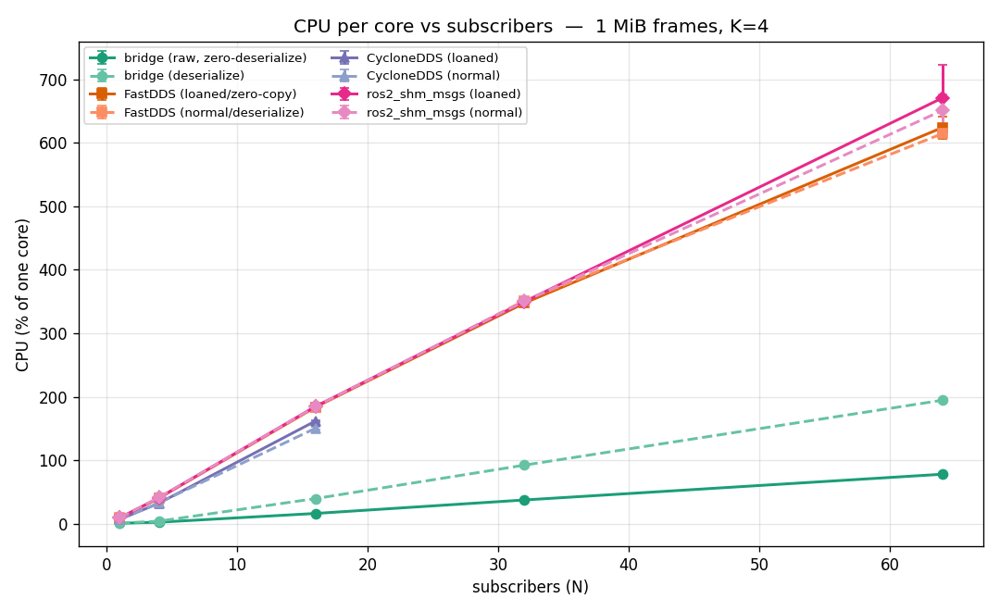
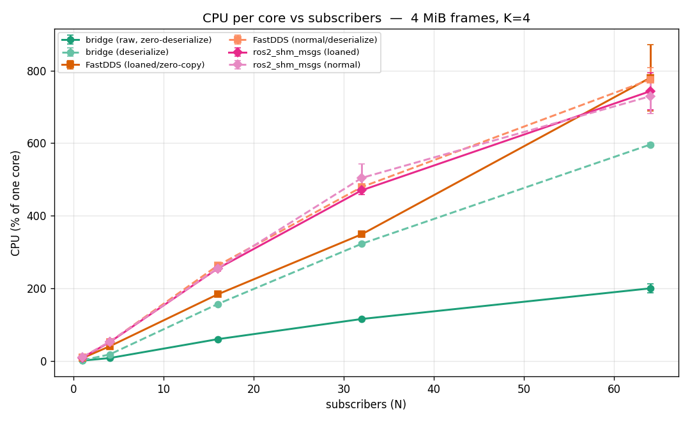
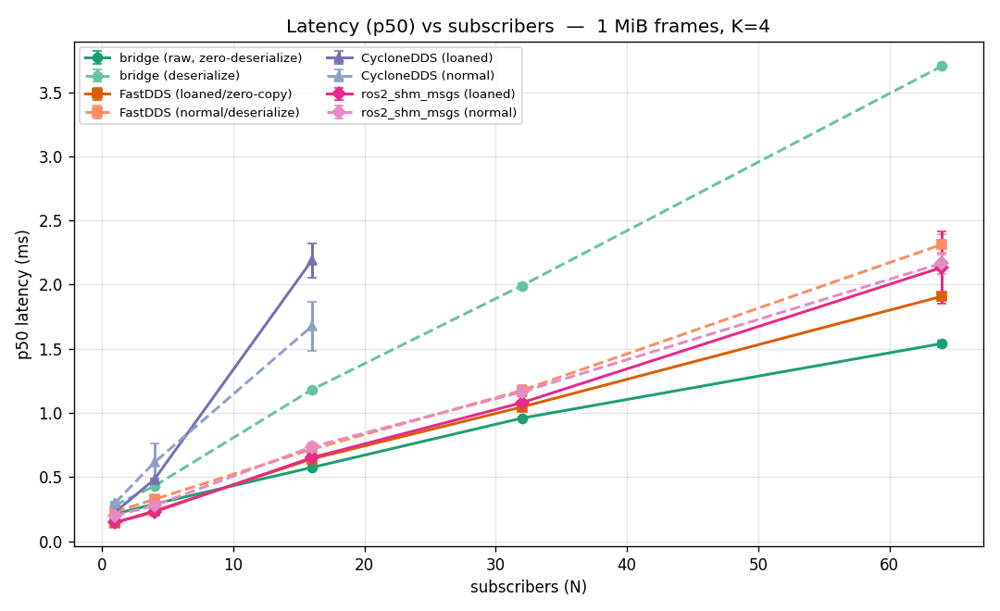
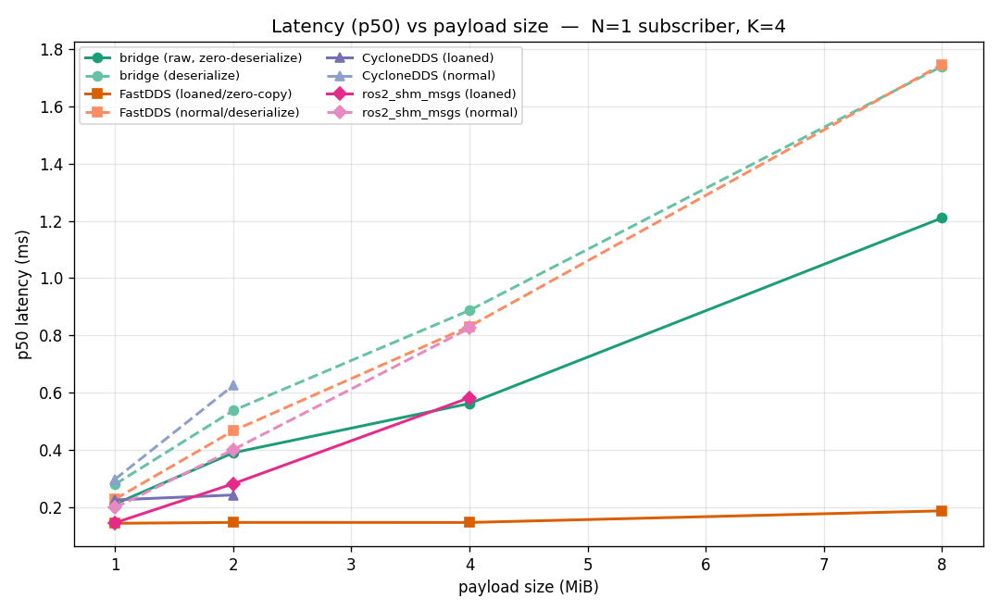
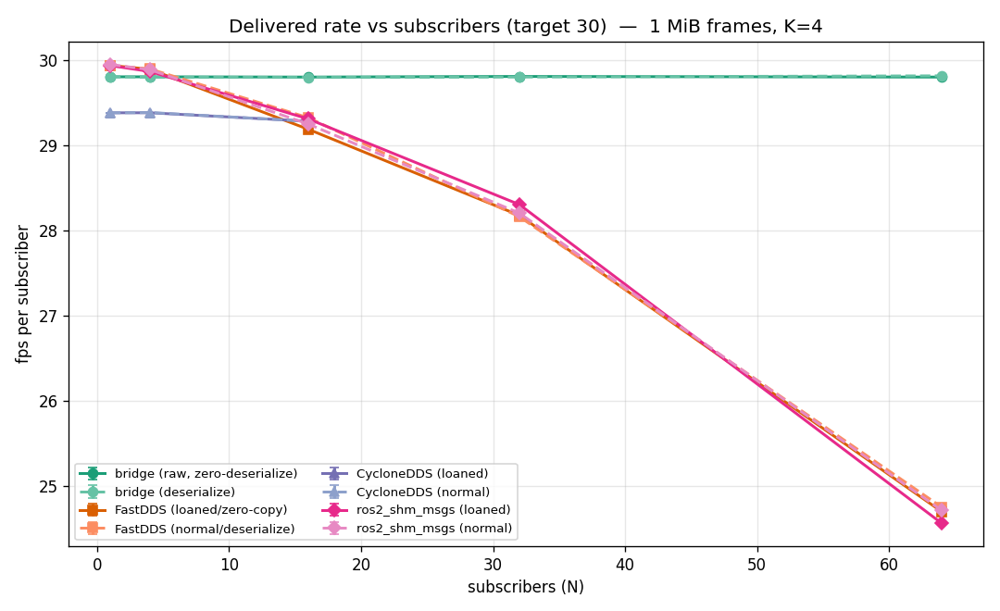

# test_runs — benchmark methodology & results

This folder documents **how** the transport comparison was run, **what** was
measured, and the resulting graphs. Raw data is in [`data/sweep.csv`](data/sweep.csv);
graphs are regenerated with [`make_graphs.py`](make_graphs.py).

---

## 1. What we compared

Four local zero-copy-capable transports, head to head:

| transport | mechanism |
|---|---|
| **bridge** (this project) | `/dev/shm` seqlock + futex wakeup |
| **FastDDS** | RTPS with `data-sharing` (shared-memory loaned messages) |
| **CycloneDDS** | RTPS with **iceoryx** (RouDi) shared-memory backend |
| **ros2_shm_msgs** | fixed-size loaned message types over FastDDS data-sharing |

Each transport was tested in **two modes** so the comparison is apples-to-apples:
- **zero-copy / loaned / raw** — the consumer gets a pointer; no deserialization.
- **normal / deserialize** — the consumer rebuilds a typed message every frame.

The bridge's two modes are `raw_flat` (hand back bytes) and `deserialize` (rebuild
a `sensor_msgs::Image` every frame), matching the DDS loaned/normal split exactly.

---

## 2. Industry-standard methodology (Apex.AI `performance_test`)

The harness follows the conventions of **Apex.AI `performance_test`**, the de-facto
ROS 2 transport benchmark, plus standard latency-benchmark hygiene:

- **One process, threads** (intra-process style): 1 publisher thread + N subscriber
  threads, so we measure the transport, not inter-process scheduling noise.
- **Fixed publish rate, absolute schedule** (30 Hz via `sleep_until(t0 + k·period)`)
  to **avoid coordinated omission** — a late frame still gets its true timestamp.
- **In-payload timestamp**: `CLOCK_MONOTONIC` stamped into the first 8 bytes at
  publish, read at receipt → end-to-end latency per frame.
- **Percentiles, not just mean**: p50 / p90 / p99 / p99.9 / max per run.
- **Warm-up trim**: first 20 % of samples discarded (JIT/cache/page-fault settle).
- **K repeated runs** → **mean ± standard deviation** across runs (the error bars).
- **Whole-system-fair CPU**: headline CPU is the **pid-set sum** (benchmark process
  **+ the iox-roudi daemon** for CycloneDDS), so DDS gets no free ride for work it
  offloads to a daemon, and the number is immune to unrelated desktop activity.
- **Health gates**: a run is flagged/stopped if system CPU or RAM exceeds 95 %, a
  subscriber is lost, or the process crashes — every such event is logged
  in [`data/stops.log`](data/stops.log) rather than silently dropped.

---

## 3. Which images, how many, what sizes

The workload is **fixed-size image-like frames** — the same shape `performance_test`
uses for its `Image`/`Array`/`PointCloud` ladders.

- **Image type:** a flat `uint8` buffer (FLAT encoding for the bridge; a
  `sensor_msgs/Image` for the DDS variable path; the fixed `Image1m…Image8m`
  compile-time types for ros2_shm_msgs).
- **Payload sizes (the "image ladder"):** **1 MiB, 2 MiB, 4 MiB, 8 MiB**
  (1 048 576 / 2 097 152 / 4 194 304 / 8 388 608 bytes). These match the true
  on-wire sizes of the ros2_shm_msgs fixed types so every transport ships identical
  bytes at each rung. (Smaller 8 KiB/512 KiB rungs were dropped — at those sizes
  fixed-cost overhead dominates and the comparison is less informative for the
  large-data use case this transport targets.)
- **Frame count per point:** 30 Hz × 10 s = **~300 frames per subscriber per run**,
  × **K=4 runs** = **~1 200 timed frames per data point per subscriber**. With N up
  to 64 subscribers, a single 8-subscriber point alone times ~9 600 frames.
- **Subscriber counts (N):** **1, 4, 16, 32, 64** — to trace how each transport
  scales from one consumer to a heavy fan-out.

Total grid: 4 sizes × 5 N × ~8 transport-modes × 4 runs ≈ **hundreds of runs,
hundreds of thousands of individually-timed frames.**

**Environment:** 8-core / 12-thread laptop (i5-13420H; 12 logical CPUs), governor `powersave` (no sudo for `performance`),
turbo on. `powersave` inflates absolute milliseconds **equally** across all
transports, so the comparison is fair; absolute numbers are conservative. Full
environment snapshot: [`data/env.txt`](data/env.txt).

---

## 4. Results — the graphs

All regenerated by `python3 make_graphs.py` from `data/sweep.csv`.

### CPU vs subscribers (1 MiB) — the headline


Both lines **rise with subscriber count** — delivering to N readers is inherently
O(N) work — but the bridge's slope is far gentler: **~1.2 %/subscriber** vs every DDS
transport's **~10 %/subscriber** (~8× steeper). At N=64 the bridge raw path is at
**78 % of one core**; FastDDS / ros2_shm_msgs are at **~620–670 %** (~6–7 cores).
This is the futex payoff: readers sleep until woken (no busy-poll), so the
per-subscriber CPU constant is small — the win is a lower *slope*, not a lower
complexity class. (RAM, by contrast, IS O(1) in subscribers — flat ~43–45 % across
N=1→64 — because all readers map one shared copy.)

### CPU vs subscribers (4 MiB) — the story holds at larger sizes


### Latency (p50) vs subscribers (1 MiB) — the crossover


At low N, FastDDS-loaned wins latency. The curves **cross near N≈16**: beyond it the
bridge leads, because the DDS transports become CPU-starved and miss deadlines while
the bridge still has headroom.

### Latency (p50) vs payload size (N=1) — O(1) zero-copy vs O(size) copy


**FastDDS-loaned is flat in size** (~0.15 ms at 1–8 MiB) because true zero-copy
hands over a pointer — nothing is copied. The bridge's read **copies the bytes**, so
its latency is **O(size)** (0.21 → 1.2 ms). This is the one axis where DDS-loaned is
categorically better.

### Delivered rate vs subscribers (1 MiB) — integrity under load


The bridge holds ~29.8 fps with ~0 % loss to N=64. The DDS transports drop their
delivered rate (down to 13–25 fps) once CPU-bound; CycloneDDS **crashes at N=32**
(iceoryx pool exhaustion) and is absent beyond N=16 on the plots.

---

## 5. Observed failure modes

From [`data/stops.log`](data/stops.log):
- **CycloneDDS + iceoryx**: SIGABRT (`invalid allocator`) at **N=32** for 1m/2m, and
  **could not start at all** for 4m/8m at N=1 — the default RouDi mempool can't hold
  those chunk sizes. Least robust.
- **ros2_shm_msgs**: **SIGSEGV at N=1 for the 8 MiB** fixed type; CPU-gated at
  larger N. It is FastDDS underneath, so it inherits FastDDS's ~10 %/sub cost plus
  this extra fragility.
- **FastDDS**: never crashed, but hit the **95 % CPU gate** at N=64 for the larger
  sizes — it runs out of cores, not memory.
- **bridge**: only the *deserialize* mode at 8 MiB / N=64 gated (≈10 cores doing
  per-frame 8 MiB copies × 64); the raw path never gated anywhere.

---

## 6. Reproduce
The benchmark binaries live in `src/shm_bridge_cpp/benchmark/`. The driver that
produced this `sweep.csv` is `tests/run_test5.py` (in the parent workspace):
```bash
K=4 NLIST="1 4 16 32 64" python3 tests/run_test5.py
```
Then copy the resulting `sweep.csv` into `data/` and run `python3 make_graphs.py`.
